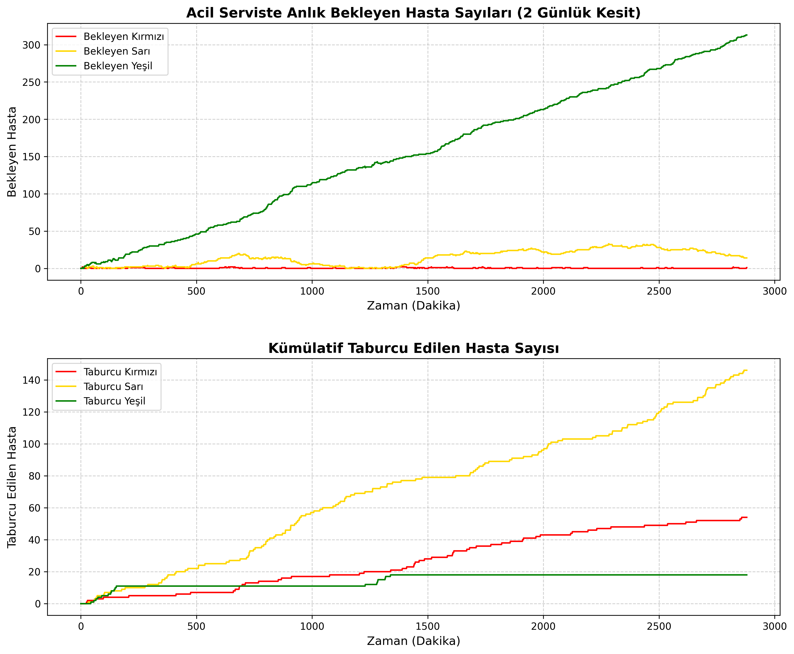

# Acil Servis Simülasyonu Proje Raporu

## 1. Proje Özeti
Bu proje, bir hastanenin acil servisine gelen hastaların bekleme sürelerini ve acil servis kaynaklarının (doktor, hemşire) kullanım oranlarını analiz etmek amacıyla geliştirilmiş bir **Ayrık Olay Simülasyonu (Discrete Event Simulation)** uygulamasıdır. Projenin temel amacı, farklı aciliyet durumlarına sahip hastaların (Kırmızı, Sarı, Yeşil alan) triyaj ve tedavi süreçlerini modelleyerek darboğazları tespit etmek ve kapasite planlamasına yardımcı olmaktır.

Proje, hem temel istatistikleri terminal üzerinden sunan bir betik (`acil_servis_simulasyonu.py`) hem de simülasyon sürecini canlı grafikle arayüz üzerinden gösteren bir web kontrol paneli (`dashboard.py`) olmak üzere iki ana bileşenden oluşmaktadır.

---

## 2. Kullanılan Teknolojiler ve Kütüphaneler
*   **Python:** Projenin temel programlama dili.
*   **SimPy:** Ayrık olay simülasyon altyapısını kurmak, sıraları ve zaman akışını yönetmek için kullanılan kütüphane.
*   **Streamlit:** Simülasyon sonuçlarını web tabanlı ve interaktif bir kontrol paneli üzerinden görselleştirmek için kullanılan çatı.
*   **Pandas:** Simülasyon sırasında elde edilen verilerin zaman serisi halinde tablo objelerine (DataFrame) dönüştürülmesi ve istatistiksel işlemler için kullanılmıştır.
*   **Random & Statistics:** Olasılık dağılımlarının hesaplanması ve süre analizleri için dâhilî Python kütüphaneleri.

---

## 3. Sistem Mimarisi ve İşleyiş Teorisi

Simülasyona gelen hastalar, standart bir **Triyaj Sistemi** ile sıralanırlar:
1.  **Kırmızı Alan (Aciliyet Seviyesi 1 Yüksek):** Kritik vakalardır. Olasılık olarak hastaların %10'unu oluşturur. Tedavileri uzun sürer (Ortalama 60 dakika).
2.  **Sarı Alan (Aciliyet Seviyesi 2 Orta):** Orta aciliyetli vakalardır. Olasılık olarak hastaların %30'unu oluşturur. Ortalama 30 dakika tedavi alırlar.
3.  **Yeşil Alan (Aciliyet Seviyesi 3 Düşük):** Hafif vakalardır. Hastaların büyük çoğunluğunu (%60) oluşturur. Hızlı tedavi edilirler (Ortalama 15 dakika).

### Simülasyon Süreci
*   **Hasta Gelişi:** Sisteme ortalama her 5 dakikada bir (üstel dağılım kullanılarak) yeni bir hasta giriş yapar.
*   **Triyaj Masası:** Hasta önce hemşire sırasına girer. SimPy'ın `PriorityResource` yapısı gereği kırmızı alan hastalar, diğer hastaların önüne geçer. Triyaj 3 ile 5 dakika arasında sürer.
*   **Doktor Randevusu:** Triyajı tamamlanan hasta doktor sırasına girer. Burada da `PriorityResource` sayesinde öncelikli (Kırmızı > Sarı > Yeşil) tedavi işlemi başlar. Tedavi süreleri hastanın kategorisine özel rastgele yoğunlukta dağıtılmıştır.
*   **Taburcu:** Tedavisi biten hasta sistemden çıkar.

---

## 4. Dosya Yapısı

### 4.1. `acil_servis_simulasyonu.py`
Projenin çekirdek simülasyon dosyasıdır.
*   **Çalışma:** 24 saatlik (1440 dakika) bir gün simüle edilir. 3 doktor ve 5 hemşirelik bir kapasite mevcuttur.
*   **Çıktı:** Konsol üzerine toplam tedavi edilen hasta sayısını, her renk kategorisi için maksimum ve ortalama bekleme sürelerini gösteren ayrıntılı bir metin raporu yazdırır.

### 4.2. `dashboard.py`
Projenin görselleştirme modülüdür. Streamlit ile çalışır.
*   **Çalışma:** SimPy simülasyonunu arka planda önceden koşturur ve 2 günlük bir veri üretir. DataFrame'e kaydedilen bu veriyi "zamanı sardırma" mantığı ile ekranda oynatır.
*   **Arayüz:** 
    * Simülasyon oynatma hızını ayarlamak için bir kaydırma çubuğu (slider) bulunur.
    * Anlık bekleyen hasta sayıları, tedavisi tamamlanıp taburcu olanların sayısı anlık metrik bileşenlerinde gösterilir.
    * Alt kısımda gerçek zamanlı akan, hastaların yığılma durumunu gösteren bir çizgi grafik bulunur.

---

## 5. Çalıştırma Talimatları (Nasıl Kullanılır?)

Gerekli paketlerin sisteminizde yüklü olduğundan emin olun:
```bash
pip install simpy streamlit pandas matplotlib
```

*   **Konsol Tabanlı Rapor İçin:** Terimal üzerinden doğrudan Python dosyasını çalıştırın.
    ```bash
    python acil_servis_simulasyonu.py
    ```
*   **Canlı Kontrol Paneli (Dashboard) İçin:** Streamlit kullanarak grafiksel arayüzü başlatın.
    ```bash
    streamlit run dashboard.py
    ```

## 6. Grafiksel Arayüz Analizi
Streamlit tabanlı grafiksel arayüz (Dashboard), sistemdeki darboğazların anlık olarak tespit edilmesini sağlar. Hastaların yoğunlaştığı saatlerde kırmızı, sarı veya yeşil alanlardaki bekleyen hasta sayısındaki yığılmalar, simülasyonun sunduğu hareketli grafik sayesinde net bir şekilde gözlemlenir. Arayüzün sunduğu simülasyon oynatma hızı modifikasyonu sayesinde, farklı sağlık politikalarının (örneğin personel vardiya saatleri veya acil durum planları) performansı saniyeler içinde test edilebilir.



## 7. Sonuç Değerlendirme
Proje sayesinde, bir acil servisteki hastaların polikliniklere geliş şablonları aslına uygun bir rastlantısallıkla canlandırılmıştır. Simülasyon verileri incelediğinde, kırmızı alan gibi kritik hastaların öncelikli kuyruk mantığında bekletilmeden işleme alındığı doğrulanmıştır. Simülasyon sonunda elde edilen genel bekleme süresi ve toplam tedavi edilen hasta verileri kullanılarak, hastanenin kaynak planlaması optimize edilebilir.

## 8. Geliştirme İpuçları
Bu sistem, kapasitelerin (doktor ve hemşire sayısı) değiştirilmesiyle farklı verim raporları çıkarılmasını sağlar. Örneğin, bekleme süreleri tehlikeli limitlere yaklaşıyorsa kodu kurcalayıp `KAPASITE_DOKTOR = 4` şeklinde modifikasyonlar yaparak olası iyileştirmelerin simülasyonunu rahatlıkla çıkarabilirsiniz. Proje modüler olduğu için daha kompleks alanlar, ameliyathaneler veya tetkik (Röntgen/MR) sıraları eklenerek büyütülebilir yapıdadır.
